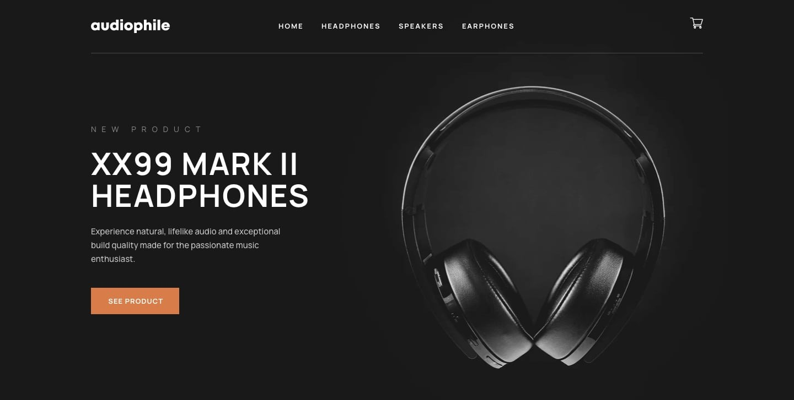
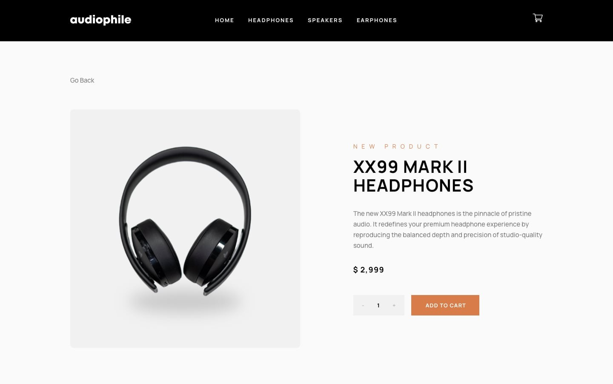
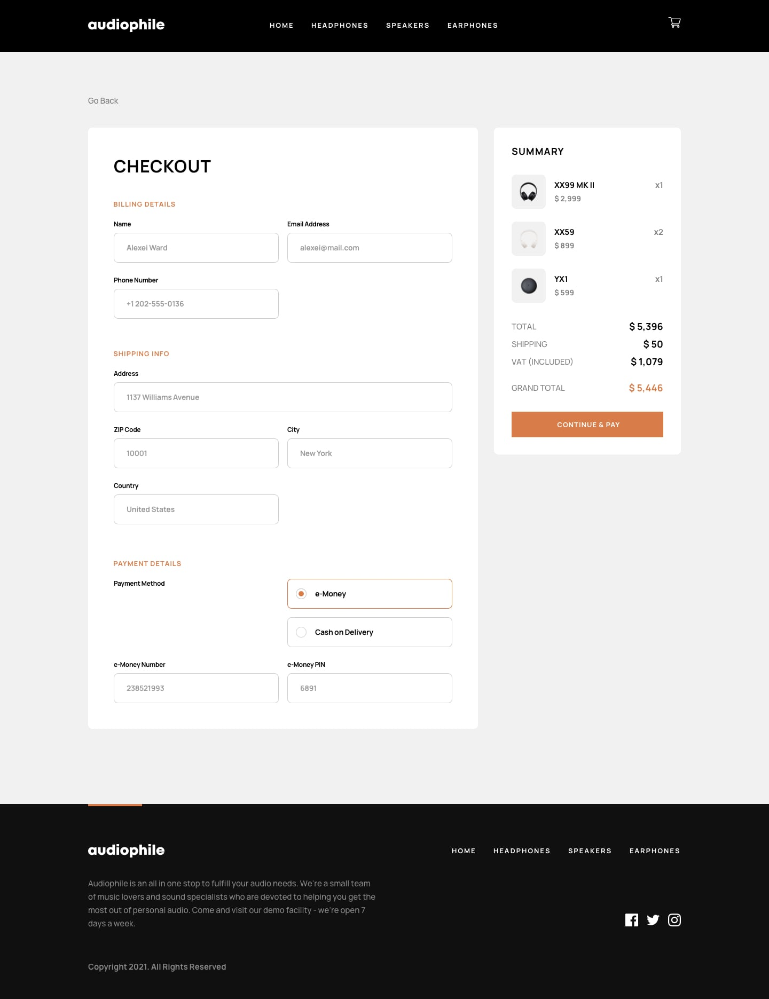

# 🚀 Audiophile E-Commerce Website

A fully responsive, modern **E-commerce web application** built with **React + Vite**, inspired by a premium audio gear brand.

This project focuses on **pixel-perfect UI**, **clean architecture**, and **real-world frontend practices** like state management, routing, and component reusability.

---

## 🔥 Live Demo

[](https://audiophile-ecommerce-eight-sigma.vercel.app/)
[](https://github.com/MsadafK/audiophile-ecommerce)

---

## ✨ Features

* 🛍️ Browse products by category (Headphones, Speakers, Earphones)
* 📄 Product details page with gallery, features, and included items
* 🛒 Add to cart with quantity control
* 🧾 Fully functional checkout page
* 💳 Payment method selection (e-Money / Cash on Delivery)
* ✅ Order confirmation modal
* 📱 Fully responsive (Mobile, Tablet, Desktop)
* 🔁 Persistent cart state using Context API
* ⚡ Fast performance with Vite

---

## 🖼️ Preview

### 🏠 Home Page



### 📦 Product Page



### 🛒 Checkout Page



---

## 🧠 Tech Stack

* **React (v19)**
* **Vite**
* **JavaScript (ES6+)**
* **CSS3 (Custom styling)**
* **React Context API (State Management)**

---

## 📂 Project Structure

```
audiophile-ecommerce/
│
├── public/assets        # All images & static assets
├── src/
│   ├── components/      # Reusable UI components
│   ├── context/         # Global state (Cart)
│   ├── data/            # Products JSON
│   ├── pages/           # App pages (Home, Product, Checkout, etc.)
│   ├── App.jsx
│   └── main.jsx
│
├── vite.config.js
├── package.json
└── vercel.json
```

---

## ⚙️ Installation & Setup

```bash
# Clone the repo
git clone https://github.com/your-username/audiophile-ecommerce.git

# Navigate into project
cd audiophile-ecommerce

# Install dependencies
npm install

# Run development server
npm run dev
```

---

## 📦 Build for Production

```bash
npm run build
```

---

## 🚀 Deployment

This project is deployed on **Vercel**

```bash
npm run build
```

Then connect your repo to Vercel.

---

## 🧩 Key Learnings

* Component-based architecture in React
* Managing global state using Context API
* Handling cart logic (add/remove/update items)
* Building scalable folder structure
* Creating reusable UI components
* Implementing responsive layouts from design

---

## 🎯 Future Improvements

* 🔐 Authentication (Login / Signup)
* 💳 Real payment gateway integration (Stripe)
* 🔎 Search & filtering
* 🌐 Backend integration (Node.js / Express)
* 📊 Admin dashboard

---

## 👨‍💻 Author

**Mohd Sadaf**
Frontend Developer

* [](https://github.com/MsadafK)
* [](https://www.linkedin.com/in/mohd-sadaf/)

---

## ⭐ If you like this project

Give it a ⭐ on GitHub — it helps a lot!

---

## 📬 Feedback

If you have suggestions or improvements, feel free to open an issue or connect!

